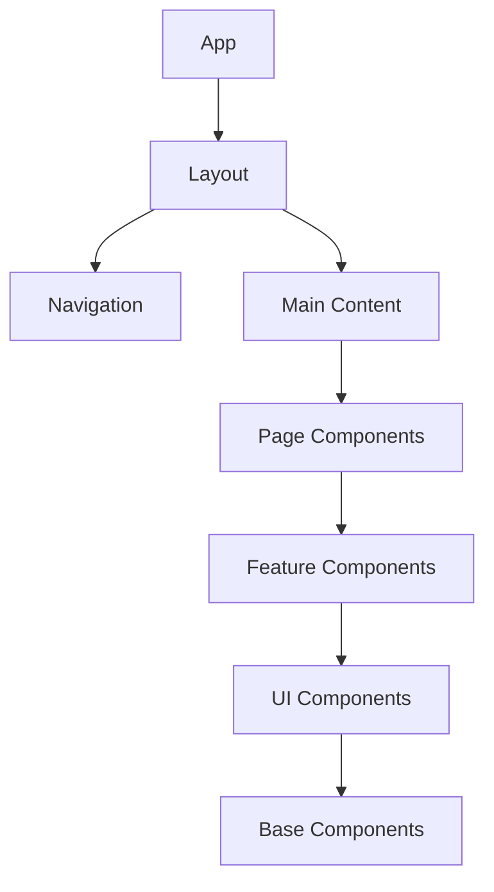
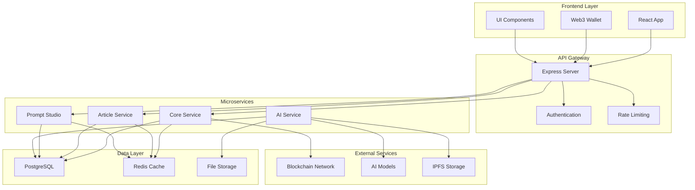
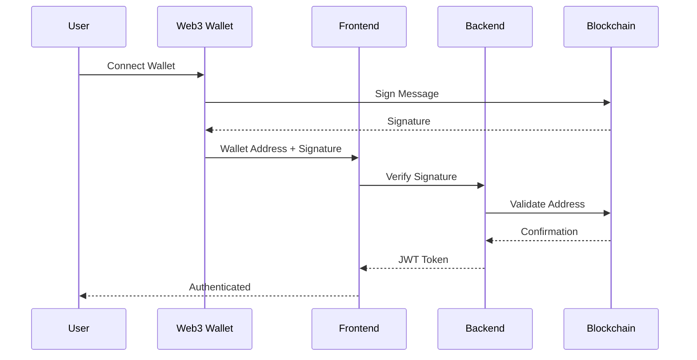
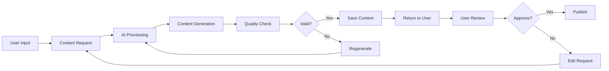
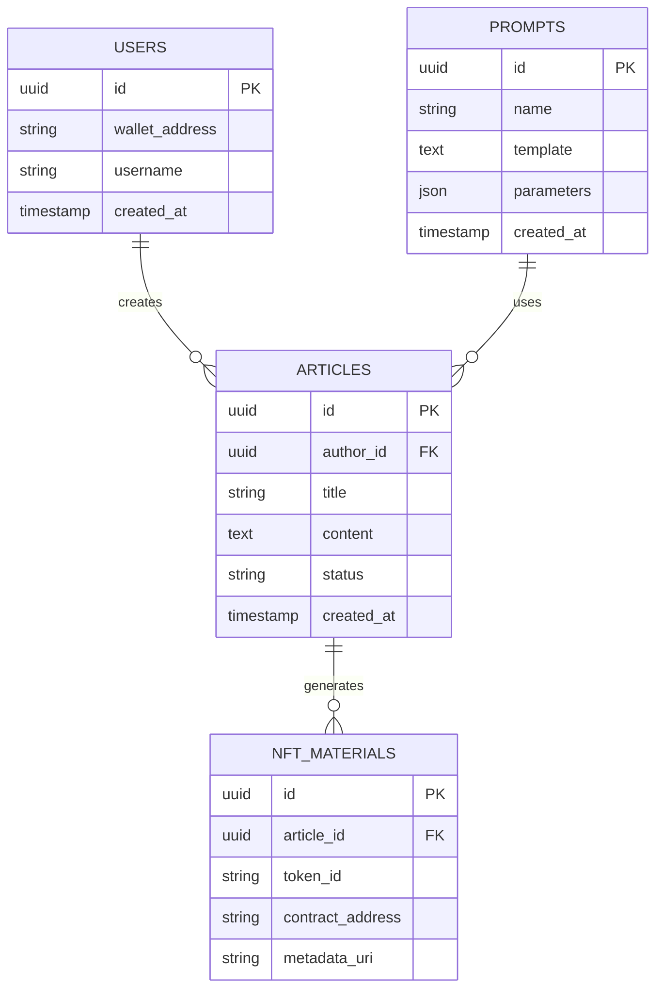
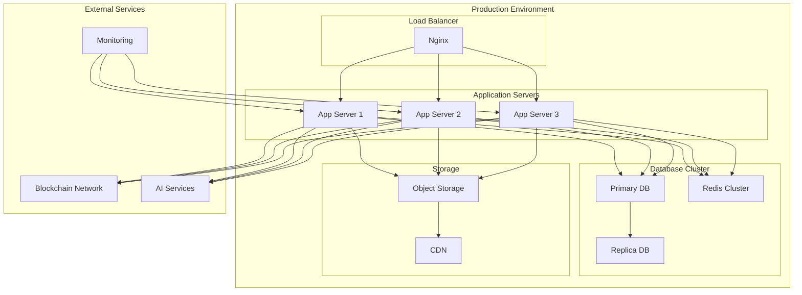

# Architecture Diagrams

This page demonstrates how to use Mermaid diagrams in Base Library documentation.

## Application Structure



## Backend Architecture



## User Authentication Flow



## Content Generation Workflow



## Database Schema



## Deployment Architecture



## Development Workflow

```mermaid
gitgraph
    commit id: "Initial"
    branch develop
    checkout develop
    commit id: "Feature 1"
    commit id: "Feature 2"
    branch feature/auth
    checkout feature/auth
    commit id: "Auth Setup"
    commit id: "Web3 Integration"
    checkout develop
    merge feature/auth
    commit id: "Auth Complete"
    branch feature/content
    checkout feature/content
    commit id: "AI Integration"
    commit id: "Content Generation"
    checkout develop
    merge feature/content
    commit id: "Content Complete"
    checkout main
    merge develop
    commit id: "Release v1.0"
```

## How to Use Mermaid Diagrams

To add Mermaid diagrams to your documentation:

1. **Wrap your diagram in code blocks** with `mermaid` language identifier
2. **Use proper syntax** for different diagram types:
   - `graph` or `flowchart` for flowcharts
   - `sequenceDiagram` for sequence diagrams
   - `erDiagram` for entity relationship diagrams
   - `gitgraph` for Git workflows
   - `pie` for pie charts
   - `gantt` for Gantt charts

3. **Example syntax:**
   ```mermaid
   graph TD
       A[Start] --> B[Process]
       B --> C[End]
   ```

4. **Themes are automatically applied** based on your site's color mode (light/dark)

## Tips for Better Diagrams

- Use descriptive node labels
- Group related elements with subgraphs
- Use consistent styling and colors
- Keep diagrams simple and readable
- Test diagrams in both light and dark modes
