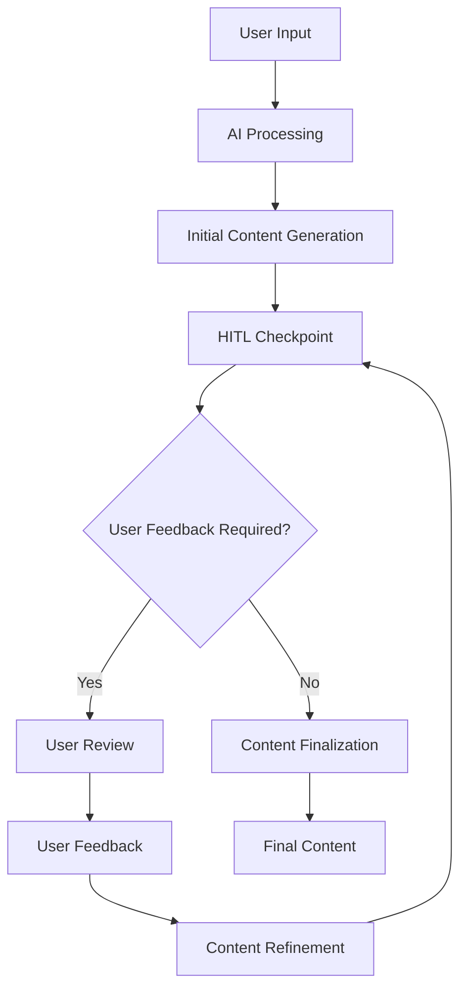

# Human-in-the-Loop (HITL) Workflow

Base Library's Human-in-the-Loop (HITL) system enables interactive content refinement during the educational material generation process. This system allows users to provide feedback, make corrections, and guide the AI to create precisely the content they need.

## What is HITL?

Human-in-the-Loop (HITL) is an interactive content generation system that:

- **Enables User Feedback** - Allows users to provide input during content generation
- **Supports Iterative Refinement** - Multiple rounds of content improvement
- **Provides Quality Control** - Users can approve or modify generated content
- **Offers Custom Instructions** - Users can guide the AI with specific requirements
- **Ensures Accuracy** - Human oversight ensures content quality and accuracy

## HITL Workflow Process

### 1. Initial Content Generation

The HITL process begins with the AI generating initial educational content based on user input:



### 2. Interactive Refinement

During the refinement process, users can:

- **Review Generated Content** - Examine the AI-generated material
- **Provide Specific Feedback** - Give detailed instructions for improvement
- **Approve Content** - Accept content that meets requirements
- **Request Modifications** - Ask for specific changes or additions

### 3. Quality Assurance

The HITL system ensures content quality through:

- **Human Oversight** - Users review all generated content
- **Accuracy Verification** - Users verify factual correctness
- **Completeness Check** - Users ensure comprehensive coverage
- **Clarity Assessment** - Users verify content clarity and understanding

## HITL Interface Components

### Modal Dialog System

The HITL interface uses modal dialogs to present content for user review:

```tsx
interface HITLModalProps {
  isOpen: boolean;
  onClose: () => void;
  content: string;
  onApprove: () => void;
  onModify: (feedback: string) => void;
  currentStep: string;
  totalSteps: number;
}
```

### Content Review Interface

```tsx
function HITLContentReview({ content, onApprove, onModify }) {
  return (
    <div className="hitl-review">
      <div className="content-preview">
        <MarkdownViewer content={content} />
      </div>
      
      <div className="feedback-section">
        <textarea
          placeholder="Provide feedback for improvement..."
          onChange={(e) => setFeedback(e.target.value)}
        />
        
        <div className="actions">
          <button onClick={onApprove}>Approve</button>
          <button onClick={() => onModify(feedback)}>Modify</button>
        </div>
      </div>
    </div>
  );
}
```

## HITL Configuration Options

### Basic HITL Settings

```tsx
interface HITLSettings {
  enabled: boolean;
  interactiveEditing: boolean;
  questionGeneration: boolean;
  gapAnalysis: boolean;
  customInstructions: string;
}
```

### Advanced Configuration

```tsx
interface AdvancedHITLSettings {
  materialEditing: boolean;
  questionApproval: boolean;
  contentRefinement: boolean;
  qualityControl: boolean;
  iterationLimit: number;
  autoApprove: boolean;
}
```

## HITL Workflow Examples

### Example 1: Educational Material Creation

```typescript
// Step 1: Initial content generation
const initialContent = await generateContent({
  topic: "Quadratic Equations",
  difficulty: "intermediate",
  hitl: true
});

// Step 2: User review and feedback
const userFeedback = "Add more examples with step-by-step solutions";

// Step 3: Content refinement
const refinedContent = await refineContent({
  content: initialContent,
  feedback: userFeedback
});

// Step 4: Final approval
const finalContent = await approveContent(refinedContent);
```

### Example 2: Question Generation

```typescript
// Step 1: Generate initial questions
const questions = await generateQuestions({
  topic: "Calculus",
  difficulty: "advanced",
  hitl: true
});

// Step 2: User review
const userFeedback = "Make the questions more practical and application-focused";

// Step 3: Refine questions
const refinedQuestions = await refineQuestions({
  questions: questions,
  feedback: userFeedback
});

// Step 4: Final approval
const finalQuestions = await approveQuestions(refinedQuestions);
```

## HITL Implementation

### Frontend Implementation

```tsx
import { useState, useEffect } from 'react';
import { HITLModal } from '@/components/hitl/HITLModal';
import { useHITL } from '@/hooks/useHITL';

function ContentGenerationPage() {
  const [hitlEnabled, setHitlEnabled] = useState(true);
  const [currentStep, setCurrentStep] = useState('');
  const { generateContent, refineContent, approveContent } = useHITL();

  const handleContentGeneration = async (input) => {
    if (hitlEnabled) {
      const result = await generateContent(input);
      if (result.requiresFeedback) {
        setCurrentStep('content-review');
        // Show HITL modal
      }
    } else {
      // Direct generation without HITL
      const content = await generateContentDirect(input);
    }
  };

  return (
    <div className="content-generation">
      <HITLSettings 
        enabled={hitlEnabled}
        onChange={setHitlEnabled}
      />
      
      <ContentInput onGenerate={handleContentGeneration} />
      
      <HITLModal
        isOpen={currentStep === 'content-review'}
        onClose={() => setCurrentStep('')}
        onApprove={approveContent}
        onModify={refineContent}
      />
    </div>
  );
}
```

### Backend Integration

```python
# HITL workflow management
class HITLWorkflow:
    def __init__(self):
        self.current_step = None
        self.user_feedback = None
        self.iteration_count = 0
        self.max_iterations = 5

    async def process_with_hitl(self, input_data):
        """Process content generation with HITL"""
        self.current_step = "content_generation"
        content = await self.generate_initial_content(input_data)
        
        if self.requires_hitl_feedback(content):
            return {
                "status": "awaiting_feedback",
                "content": content,
                "step": self.current_step
            }
        
        return {"status": "completed", "content": content}

    async def apply_feedback(self, feedback):
        """Apply user feedback to content"""
        self.user_feedback = feedback
        self.iteration_count += 1
        
        if self.iteration_count >= self.max_iterations:
            return {"status": "max_iterations_reached"}
        
        refined_content = await self.refine_content(feedback)
        return {"status": "refined", "content": refined_content}
```

## HITL Best Practices

### For Users

#### Effective Feedback
- **Be Specific** - Provide detailed, specific instructions
- **Use Examples** - Include examples of what you want
- **Be Constructive** - Focus on improvements rather than criticism
- **Stay Focused** - Address one aspect at a time

#### Feedback Examples
```typescript
// Good feedback
"Add 3 more examples with step-by-step solutions"
"Include a diagram showing the process"
"Make the explanation more beginner-friendly"

// Less effective feedback
"Make it better"
"Add more stuff"
"Fix this"
```

### For Developers

#### HITL Implementation
- **Clear Interface** - Design intuitive HITL interfaces
- **Progress Indication** - Show users where they are in the process
- **Feedback Validation** - Validate user feedback before processing
- **Error Handling** - Handle HITL errors gracefully

#### Performance Optimization
- **Lazy Loading** - Load HITL content on demand
- **Caching** - Cache generated content for faster access
- **Debouncing** - Prevent excessive API calls
- **State Management** - Efficiently manage HITL state

## HITL Use Cases

### Educational Material Creation
- **Content Refinement** - Improve generated educational content
- **Difficulty Adjustment** - Modify content difficulty level
- **Example Addition** - Add more examples and exercises
- **Clarity Improvement** - Enhance content clarity and understanding

### Question Generation
- **Question Quality** - Ensure high-quality questions
- **Difficulty Balance** - Balance question difficulty
- **Topic Coverage** - Ensure comprehensive topic coverage
- **Answer Accuracy** - Verify answer correctness

### Content Customization
- **Style Adaptation** - Adapt content to specific styles
- **Audience Targeting** - Customize content for specific audiences
- **Format Adjustment** - Modify content format and structure
- **Length Control** - Adjust content length and detail level

## HITL Monitoring and Analytics

### User Engagement Metrics
```typescript
interface HITLMetrics {
  totalInteractions: number;
  averageIterations: number;
  userSatisfaction: number;
  contentQuality: number;
  timeToCompletion: number;
}
```

### Performance Tracking
```typescript
interface HITLPerformance {
  responseTime: number;
  errorRate: number;
  userDropoffRate: number;
  contentApprovalRate: number;
  iterationEfficiency: number;
}
```

## Troubleshooting HITL Issues

### Common Problems

#### HITL Not Triggering
- **Check Settings** - Verify HITL is enabled
- **Review Configuration** - Ensure proper HITL configuration
- **Check API Status** - Verify backend HITL service is running
- **Review Logs** - Check application logs for errors

#### Feedback Not Processing
- **Validate Input** - Ensure feedback is properly formatted
- **Check Network** - Verify network connectivity
- **Review Backend** - Check backend processing
- **Clear Cache** - Clear application cache

#### Performance Issues
- **Optimize Queries** - Improve database queries
- **Implement Caching** - Add caching for better performance
- **Monitor Resources** - Track system resource usage
- **Scale Infrastructure** - Scale backend services as needed

## Advanced HITL Features

### Multi-step Workflows
```typescript
interface MultiStepHITL {
  steps: HITLStep[];
  currentStep: number;
  completedSteps: number[];
  userProgress: UserProgress;
}

interface HITLStep {
  id: string;
  name: string;
  description: string;
  required: boolean;
  userInput: boolean;
}
```

### Collaborative HITL
```typescript
interface CollaborativeHITL {
  participants: User[];
  sharedContent: Content;
  feedbackHistory: Feedback[];
  consensus: Consensus;
}
```

### AI-assisted HITL
```typescript
interface AIAssistedHITL {
  aiSuggestions: Suggestion[];
  userFeedback: Feedback;
  hybridProcessing: boolean;
  aiConfidence: number;
}
```

---

**HITL Workflow** in Base Library provides powerful tools for interactive content refinement, ensuring high-quality educational materials that meet specific user requirements.
