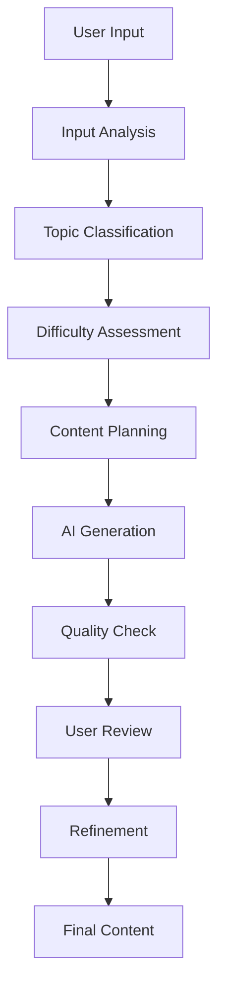

# Content Generation Overview

Base Library's content generation system leverages advanced AI models to create comprehensive educational materials from user input, handwritten notes, and interactive feedback. The system supports multiple content types, difficulty levels, and subject areas while maintaining high quality and accuracy.

## Content Generation Capabilities

### Supported Content Types

#### Educational Materials
- **Comprehensive Lessons** - Complete educational content with explanations
- **Study Guides** - Structured learning materials for exam preparation
- **Tutorials** - Step-by-step instructional content
- **Reference Materials** - Quick reference guides and cheat sheets
- **Practice Exercises** - Problem sets and practice questions

#### Assessment Content
- **Multiple Choice Questions** - Standardized assessment questions
- **Short Answer Questions** - Open-ended response questions
- **Essay Prompts** - Long-form writing assignments
- **Problem Sets** - Mathematical and scientific problems
- **Case Studies** - Real-world application scenarios

#### Interactive Content
- **Quizzes** - Interactive knowledge testing
- **Flashcards** - Memory reinforcement tools
- **Simulations** - Virtual learning experiences
- **Games** - Educational game content
- **Puzzles** - Problem-solving challenges

### Subject Area Support

#### Mathematics
- **Algebra** - Linear and quadratic equations, polynomials
- **Calculus** - Derivatives, integrals, limits, series
- **Geometry** - Shapes, angles, proofs, transformations
- **Statistics** - Probability, distributions, hypothesis testing
- **Linear Algebra** - Matrices, vectors, transformations

#### Science
- **Physics** - Mechanics, thermodynamics, electromagnetism
- **Chemistry** - Organic and inorganic chemistry, reactions
- **Biology** - Cell biology, genetics, evolution, ecology
- **Earth Science** - Geology, meteorology, astronomy
- **Environmental Science** - Sustainability, climate, ecosystems

#### Technology
- **Programming** - Python, JavaScript, Java, C++, algorithms
- **Computer Science** - Data structures, algorithms, complexity
- **Web Development** - HTML, CSS, JavaScript, frameworks
- **Data Science** - Statistics, machine learning, visualization
- **Cybersecurity** - Network security, cryptography, ethical hacking

#### Humanities
- **Literature** - Analysis, criticism, creative writing
- **History** - World history, political science, cultural studies
- **Philosophy** - Ethics, logic, metaphysics, epistemology
- **Languages** - Grammar, vocabulary, conversation, translation
- **Arts** - Visual arts, music, theater, film studies

#### Professional Skills
- **Business** - Management, marketing, finance, entrepreneurship
- **Communication** - Public speaking, writing, presentation skills
- **Leadership** - Team management, decision making, strategy
- **Project Management** - Planning, execution, risk management
- **Soft Skills** - Time management, critical thinking, creativity

## Content Generation Process

### Input Processing

#### Text Input
```typescript
interface TextInput {
  topic: string;
  description?: string;
  learningObjectives: string[];
  targetAudience: string;
  prerequisites?: string[];
}
```

#### Image Input
```typescript
interface ImageInput {
  files: File[];
  type: 'handwritten' | 'diagram' | 'chart' | 'photo';
  processing: 'ocr' | 'analysis' | 'extraction';
}
```

#### Context Setting
```typescript
interface ContentContext {
  difficulty: 'beginner' | 'intermediate' | 'advanced';
  subject: string;
  format: 'lesson' | 'quiz' | 'exercise' | 'reference';
  length: 'brief' | 'standard' | 'detailed';
  style: 'formal' | 'casual' | 'academic' | 'conversational';
}
```

### AI Processing Pipeline

#### Content Analysis


#### Generation Models
```typescript
interface GenerationModel {
  name: string;
  version: string;
  capabilities: string[];
  performance: {
    accuracy: number;
    speed: number;
    quality: number;
  };
}
```

### Content Quality Assurance

#### Automated Quality Checks
- **Factual Accuracy** - Verification of factual information
- **Completeness** - Ensuring comprehensive coverage
- **Clarity** - Readability and understanding assessment
- **Consistency** - Tone and style consistency
- **Relevance** - Topic relevance and appropriateness

#### Human-in-the-Loop (HITL) Quality Control
- **User Feedback** - Interactive content refinement
- **Expert Review** - Subject matter expert validation
- **Peer Review** - Community-based quality assessment
- **Iterative Improvement** - Multiple rounds of enhancement

## Content Generation Features

### Mathematical Formula Support

#### LaTeX Integration
```typescript
interface MathContent {
  inline: string[];      // $E = mc^2$
  display: string[];     // $$\int_0^1 x^2 dx$$
  equations: string[];   // Complex mathematical expressions
  symbols: string[];     // Greek letters and mathematical symbols
}
```

#### Formula Examples
```latex
% Basic formulas
$E = mc^2$                    % Einstein's mass-energy equivalence
$F = ma$                      % Newton's second law
$a^2 + b^2 = c^2$            % Pythagorean theorem

% Complex expressions
$$\int_{-\infty}^{\infty} e^{-x^2} dx = \sqrt{\pi}$$

% Matrices
$$\begin{pmatrix}
a & b \\
c & d
\end{pmatrix}$$
```

### Code Highlighting and Examples

#### Programming Languages
```typescript
// Python example
def fibonacci(n):
    if n <= 1:
        return n
    return fibonacci(n-1) + fibonacci(n-2)

// JavaScript example
function fibonacci(n) {
    if (n <= 1) return n;
    return fibonacci(n - 1) + fibonacci(n - 2);
}
```

#### Algorithm Explanations
```typescript
interface AlgorithmExplanation {
  pseudocode: string;
  implementation: string;
  complexity: {
    time: string;
    space: string;
  };
  examples: string[];
}
```

### Interactive Elements

#### HITL Interface
```tsx
interface HITLInterface {
  content: string;
  onApprove: () => void;
  onModify: (feedback: string) => void;
  currentStep: string;
  totalSteps: number;
  userFeedback: string;
}
```

#### Real-time Collaboration
```typescript
interface CollaborationSession {
  participants: User[];
  sharedContent: Content;
  feedbackHistory: Feedback[];
  consensus: Consensus;
}
```

## Content Export Options

### Export Formats

#### PDF Export
```typescript
interface PDFExportOptions {
  format: 'A4' | 'Letter' | 'Legal';
  orientation: 'portrait' | 'landscape';
  margins: {
    top: number;
    bottom: number;
    left: number;
    right: number;
  };
  header?: string;
  footer?: string;
  pageNumbers: boolean;
}
```

#### Markdown Export
```typescript
interface MarkdownExportOptions {
  includeMetadata: boolean;
  includeImages: boolean;
  imageFormat: 'png' | 'jpg' | 'svg';
  tableOfContents: boolean;
  codeHighlighting: boolean;
}
```

#### HTML Export
```typescript
interface HTMLExportOptions {
  includeCSS: boolean;
  responsive: boolean;
  darkMode: boolean;
  interactive: boolean;
  mathRendering: 'katex' | 'mathjax';
}
```

### Export Customization

#### Content Filtering
```typescript
interface ExportFilter {
  includeSections: string[];
  excludeSections: string[];
  difficulty: string[];
  subject: string[];
  dateRange: {
    start: Date;
    end: Date;
  };
}
```

#### Styling Options
```typescript
interface ExportStyling {
  theme: 'light' | 'dark' | 'custom';
  fontFamily: string;
  fontSize: number;
  colorScheme: ColorScheme;
  layout: 'single' | 'double' | 'book';
}
```

## Content Management

### Content Organization

#### Categories and Tags
```typescript
interface ContentCategory {
  id: string;
  name: string;
  description: string;
  parent?: string;
  children: string[];
  tags: string[];
}
```

#### Search and Filtering
```typescript
interface ContentSearch {
  query: string;
  filters: {
    subject: string[];
    difficulty: string[];
    format: string[];
    dateRange: DateRange;
    tags: string[];
  };
  sortBy: 'relevance' | 'date' | 'title' | 'rating';
  limit: number;
  offset: number;
}
```

### Content Versioning

#### Version Control
```typescript
interface ContentVersion {
  id: string;
  contentId: string;
  version: number;
  changes: Change[];
  author: User;
  timestamp: Date;
  description: string;
}
```

#### Change Tracking
```typescript
interface Change {
  type: 'addition' | 'deletion' | 'modification';
  path: string;
  oldValue: any;
  newValue: any;
  timestamp: Date;
  author: User;
}
```

## Performance Optimization

### Content Caching
```typescript
interface ContentCache {
  key: string;
  content: Content;
  timestamp: Date;
  ttl: number;
  tags: string[];
}
```

### Lazy Loading
```tsx
import { lazy, Suspense } from 'react';

const ContentViewer = lazy(() => import('@/components/ContentViewer'));
const MathRenderer = lazy(() => import('@/components/MathRenderer'));

function ContentPage() {
  return (
    <Suspense fallback={<div>Loading content...</div>}>
      <ContentViewer />
      <MathRenderer />
    </Suspense>
  );
}
```

### Content Preprocessing
```typescript
interface ContentPreprocessor {
  optimizeImages: boolean;
  compressContent: boolean;
  generateThumbnails: boolean;
  extractMetadata: boolean;
  validateContent: boolean;
}
```

## Quality Metrics

### Content Quality Assessment
```typescript
interface QualityMetrics {
  accuracy: number;        // Factual accuracy (0-1)
  completeness: number;    // Content completeness (0-1)
  clarity: number;         // Readability and clarity (0-1)
  relevance: number;       // Topic relevance (0-1)
  consistency: number;     // Style consistency (0-1)
  overall: number;         // Overall quality score (0-1)
}
```

### User Feedback Analysis
```typescript
interface FeedbackAnalysis {
  positive: number;        // Positive feedback percentage
  negative: number;        // Negative feedback percentage
  suggestions: string[];   // Common improvement suggestions
  ratings: number[];       // User rating distribution
  comments: string[];      // User comments and feedback
}
```

## Integration Examples

### Educational Platform Integration
```typescript
interface EducationalPlatform {
  lms: 'canvas' | 'blackboard' | 'moodle' | 'custom';
  api: {
    endpoint: string;
    credentials: Credentials;
    version: string;
  };
  content: {
    format: 'scorm' | 'xapi' | 'custom';
    metadata: Metadata;
    tracking: boolean;
  };
}
```

### Third-party Service Integration
```typescript
interface ThirdPartyIntegration {
  service: 'google_drive' | 'dropbox' | 'onedrive' | 'custom';
  authentication: OAuth2Credentials;
  permissions: string[];
  sync: {
    enabled: boolean;
    frequency: 'realtime' | 'hourly' | 'daily';
    direction: 'upload' | 'download' | 'bidirectional';
  };
}
```

---

**Content Generation** in Base Library provides powerful tools for creating comprehensive, high-quality educational materials with advanced AI assistance and human oversight.
