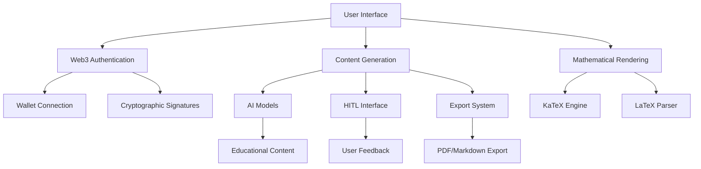

# Getting Started

Welcome to Base Library - the comprehensive educational content generation platform that leverages Web3 technology and advanced AI to create personalized learning materials from handwritten notes and user input.

## What is Base Library?

Base Library is a cutting-edge educational platform that combines:

- **Web3 Authentication** - Secure, passwordless authentication using cryptocurrency wallets
- **AI-Powered Content Generation** - Advanced AI models for creating educational materials
- **Mathematical Formula Rendering** - Full LaTeX support with KaTeX integration
- **Human-in-the-Loop (HITL)** - Interactive content refinement and customization
- **Multi-format Export** - PDF, Markdown, and other export options
- **NFT Integration** - Blockchain-based material ownership and verification

## Key Features

### 🔐 Web3 Authentication
- **Passwordless Login** - Connect using MetaMask, WalletConnect, or other Web3 wallets
- **Decentralized Identity** - Your wallet is your identity
- **Enhanced Security** - Cryptographic signatures for authentication
- **No Personal Data Storage** - Only wallet addresses are stored

### 📚 Educational Content Generation
- **Handwritten Note Processing** - Upload and process handwritten notes and sketches
- **Intelligent Material Creation** - Generate comprehensive educational content
- **Multiple Difficulty Levels** - Beginner, intermediate, and advanced content
- **Subject-Specific Generation** - Support for 11+ academic disciplines

### 🧮 Mathematical Formula Support
- **LaTeX Rendering** - Full support for mathematical expressions
- **Inline and Display Formulas** - Both inline ($E = mc^2$) and block formulas
- **Complex Mathematics** - Integrals, matrices, systems of equations
- **Code Highlighting** - Syntax highlighting for programming examples

### 🤝 Human-in-the-Loop (HITL)
- **Interactive Refinement** - Provide feedback during content generation
- **Iterative Improvement** - Multiple rounds of content enhancement
- **Quality Control** - Approve or modify generated content
- **Custom Instructions** - Guide the AI with specific requirements

## Quick Start

### Prerequisites

- **Node.js** (v18 or higher)
- **npm** or **yarn**
- **MetaMask** or compatible Web3 wallet
- **Git**

### Installation

1. **Clone the repository**
   ```bash
   git clone https://github.com/mavaleri1/Base-Library.git
   cd base-library/front
   ```

2. **Install dependencies**
   ```bash
   npm install
   ```

3. **Configure environment**
   ```bash
   cp .env.example .env
   # Edit .env with your configuration
   ```

4. **Start development server**
   ```bash
   npm run dev
   ```

5. **Open your browser**
   Navigate to `http://localhost:3001`

### First Steps

1. **Connect Your Wallet**
   - Click "Connect Wallet" on the login page
   - Approve the connection in your wallet
   - Sign the authentication message (free, no gas fees)

2. **Create Your First Material**
   - Navigate to the "Create Material" page
   - Enter your question or topic
   - Upload handwritten notes (optional)
   - Configure generation settings
   - Click "Generate Material"

3. **Use HITL for Quality Control**
   - Enable "Human-in-the-Loop" in settings
   - Provide feedback during generation
   - Approve or modify content as needed

## Platform Architecture



## Technology Stack

### Frontend
- **React 18** - Modern UI framework
- **TypeScript** - Type-safe development
- **Vite** - Fast build tool and development server
- **Tailwind CSS** - Utility-first CSS framework
- **Wagmi v2** - Web3 React hooks
- **Viem** - Ethereum library
- **TanStack Query** - Data fetching and caching

### Backend Integration
- **FastAPI** - Python web framework
- **PostgreSQL** - Database
- **JWT Authentication** - Secure token-based auth
- **RESTful API** - Standard HTTP API

### Web3 Integration
- **MetaMask** - Primary wallet support
- **WalletConnect** - Mobile wallet support
- **Ethereum** - Blockchain network
- **Cryptographic Signatures** - Secure authentication

## Next Steps

- [Platform Overview](./platform-overview/introduction) - Learn about the platform's capabilities
- [Web3 Authentication](./web3-authentication/overview) - Set up secure authentication
- [Content Generation](./content-generation/overview) - Create educational materials
- [UI Components](./ui-components/overview) - Customize the interface

## Support

- **Documentation** - Comprehensive guides and references
- **GitHub Issues** - Bug reports and feature requests
- **Community Discord** - Real-time support and discussions
- **Email Support** - Direct assistance for complex issues

---

**Ready to start?** [Connect your wallet](./web3-authentication/quick-start) and begin creating educational content with Base Library!
