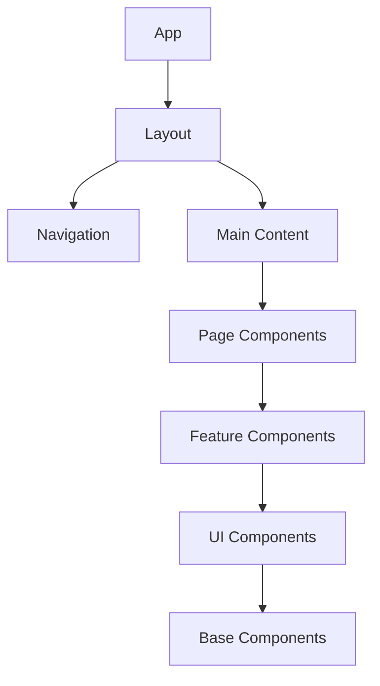

# UI Components Overview

Base Library features a comprehensive user interface built with modern React components, providing an intuitive and powerful experience for educational content generation. The UI system combines custom components with industry-standard libraries to deliver a seamless user experience.

## Component Architecture

### Core UI Principles

- **Accessibility First** - All components follow WCAG 2.1 guidelines
- **Responsive Design** - Mobile-first approach with adaptive layouts
- **Performance Optimized** - Lazy loading and efficient rendering
- **Type Safety** - Full TypeScript support for all components
- **Theme Support** - Light and dark theme compatibility

### Component Hierarchy



## Core Components

### Layout Components

#### App Layout
```tsx
interface AppLayoutProps {
  children: React.ReactNode;
  theme?: 'light' | 'dark';
  sidebar?: boolean;
  navigation?: boolean;
}
```

#### Navigation
```tsx
interface NavigationProps {
  items: NavigationItem[];
  currentPath: string;
  onNavigate: (path: string) => void;
  user?: User;
}
```

### Authentication Components

#### Web3 Wallet Button
```tsx
interface Web3WalletButtonProps {
  onConnect: () => void;
  onDisconnect: () => void;
  isConnected: boolean;
  address?: string;
  loading?: boolean;
}
```

#### Login Page
```tsx
interface LoginPageProps {
  onLogin: (credentials: LoginCredentials) => void;
  onWeb3Login: () => void;
  loading?: boolean;
  error?: string;
}
```

### Content Generation Components

#### Material Creator
```tsx
interface MaterialCreatorProps {
  onSubmit: (data: MaterialData) => void;
  onCancel: () => void;
  loading?: boolean;
  hitlEnabled?: boolean;
}
```

#### File Upload
```tsx
interface FileUploadProps {
  onUpload: (files: File[]) => void;
  acceptedTypes: string[];
  maxSize: number;
  multiple?: boolean;
}
```

#### HITL Interface
```tsx
interface HITLInterfaceProps {
  content: string;
  onApprove: () => void;
  onModify: (feedback: string) => void;
  currentStep: string;
  totalSteps: number;
}
```

## UI Component Library

### Base Components

#### Button
```tsx
interface ButtonProps {
  variant: 'primary' | 'secondary' | 'outline' | 'ghost';
  size: 'sm' | 'md' | 'lg';
  loading?: boolean;
  disabled?: boolean;
  onClick: () => void;
  children: React.ReactNode;
}
```

#### Input
```tsx
interface InputProps {
  type: 'text' | 'email' | 'password' | 'number';
  placeholder?: string;
  value: string;
  onChange: (value: string) => void;
  error?: string;
  disabled?: boolean;
}
```

#### Textarea
```tsx
interface TextareaProps {
  placeholder?: string;
  value: string;
  onChange: (value: string) => void;
  rows?: number;
  maxLength?: number;
  error?: string;
}
```

#### Select
```tsx
interface SelectProps {
  options: SelectOption[];
  value: string;
  onChange: (value: string) => void;
  placeholder?: string;
  disabled?: boolean;
}
```

### Advanced Components

#### Markdown Viewer
```tsx
interface MarkdownViewerProps {
  content: string;
  className?: string;
  enableMath?: boolean;
  enableCodeHighlight?: boolean;
}
```

#### Formula Renderer
```tsx
interface FormulaRendererProps {
  formula: string;
  inline?: boolean;
  className?: string;
}
```

#### Progress Indicator
```tsx
interface ProgressIndicatorProps {
  current: number;
  total: number;
  steps: string[];
  onStepClick?: (step: number) => void;
}
```

## Component Styling

### CSS Architecture

#### Tailwind CSS Integration
```css
/* Custom component styles */
.component-base {
  @apply px-4 py-2 rounded-md border border-gray-300;
}

.component-primary {
  @apply bg-blue-600 text-white hover:bg-blue-700;
}

.component-secondary {
  @apply bg-gray-200 text-gray-800 hover:bg-gray-300;
}
```

#### CSS Modules
```css
/* Button.module.css */
.button {
  padding: 0.5rem 1rem;
  border-radius: 0.375rem;
  border: 1px solid #d1d5db;
  background-color: #ffffff;
  color: #374151;
  font-weight: 500;
  transition: all 0.2s;
}

.button:hover {
  background-color: #f9fafb;
}

.button.primary {
  background-color: #2563eb;
  color: #ffffff;
  border-color: #2563eb;
}

.button.primary:hover {
  background-color: #1d4ed8;
}
```

### Theme Support

#### Light Theme
```css
:root {
  --color-background: #ffffff;
  --color-foreground: #000000;
  --color-primary: #2563eb;
  --color-secondary: #6b7280;
  --color-border: #d1d5db;
  --color-input: #f9fafb;
}
```

#### Dark Theme
```css
[data-theme="dark"] {
  --color-background: #000000;
  --color-foreground: #ffffff;
  --color-primary: #3b82f6;
  --color-secondary: #9ca3af;
  --color-border: #374151;
  --color-input: #1f2937;
}
```

## Component State Management

### Local State
```tsx
function ComponentWithLocalState() {
  const [value, setValue] = useState('');
  const [loading, setLoading] = useState(false);
  const [error, setError] = useState('');

  return (
    <div>
      <Input
        value={value}
        onChange={setValue}
        error={error}
      />
      <Button
        loading={loading}
        onClick={async () => {
          setLoading(true);
          try {
            await handleSubmit(value);
          } catch (err) {
            setError(err.message);
          } finally {
            setLoading(false);
          }
        }}
      >
        Submit
      </Button>
    </div>
  );
}
```

### Global State
```tsx
// Using React Context
const AppContext = createContext<AppContextType | null>(null);

function AppProvider({ children }: { children: React.ReactNode }) {
  const [user, setUser] = useState<User | null>(null);
  const [theme, setTheme] = useState<'light' | 'dark'>('light');
  const [loading, setLoading] = useState(false);

  return (
    <AppContext.Provider value={{
      user,
      setUser,
      theme,
      setTheme,
      loading,
      setLoading
    }}>
      {children}
    </AppContext.Provider>
  );
}
```

## Component Testing

### Unit Testing
```tsx
import { render, screen, fireEvent } from '@testing-library/react';
import { Button } from '@/components/ui/Button';

describe('Button Component', () => {
  it('renders with correct text', () => {
    render(<Button>Click me</Button>);
    expect(screen.getByText('Click me')).toBeInTheDocument();
  });

  it('calls onClick when clicked', () => {
    const handleClick = jest.fn();
    render(<Button onClick={handleClick}>Click me</Button>);
    
    fireEvent.click(screen.getByText('Click me'));
    expect(handleClick).toHaveBeenCalledTimes(1);
  });

  it('shows loading state', () => {
    render(<Button loading>Click me</Button>);
    expect(screen.getByRole('button')).toBeDisabled();
  });
});
```

### Integration Testing
```tsx
import { render, screen, waitFor } from '@testing-library/react';
import { MaterialCreator } from '@/components/MaterialCreator';

describe('MaterialCreator Integration', () => {
  it('creates material with valid input', async () => {
    const mockOnSubmit = jest.fn();
    render(<MaterialCreator onSubmit={mockOnSubmit} />);
    
    fireEvent.change(screen.getByLabelText('Topic'), {
      target: { value: 'Quadratic Equations' }
    });
    
    fireEvent.click(screen.getByText('Create Material'));
    
    await waitFor(() => {
      expect(mockOnSubmit).toHaveBeenCalledWith({
        topic: 'Quadratic Equations',
        difficulty: 'intermediate'
      });
    });
  });
});
```

## Performance Optimization

### Lazy Loading
```tsx
import { lazy, Suspense } from 'react';

const MaterialCreator = lazy(() => import('@/components/MaterialCreator'));
const HITLInterface = lazy(() => import('@/components/HITLInterface'));

function App() {
  return (
    <Suspense fallback={<div>Loading...</div>}>
      <MaterialCreator />
      <HITLInterface />
    </Suspense>
  );
}
```

### Memoization
```tsx
import { memo, useMemo } from 'react';

const ExpensiveComponent = memo(({ data, filter }) => {
  const filteredData = useMemo(() => {
    return data.filter(item => item.category === filter);
  }, [data, filter]);

  return (
    <div>
      {filteredData.map(item => (
        <div key={item.id}>{item.name}</div>
      ))}
    </div>
  );
});
```

### Virtual Scrolling
```tsx
import { FixedSizeList as List } from 'react-window';

function VirtualizedList({ items }) {
  const Row = ({ index, style }) => (
    <div style={style}>
      {items[index].name}
    </div>
  );

  return (
    <List
      height={600}
      itemCount={items.length}
      itemSize={50}
    >
      {Row}
    </List>
  );
}
```

## Accessibility Features

### ARIA Support
```tsx
function AccessibleButton({ children, onClick, disabled }) {
  return (
    <button
      onClick={onClick}
      disabled={disabled}
      aria-label="Submit form"
      aria-describedby="button-description"
      role="button"
      tabIndex={0}
    >
      {children}
    </button>
  );
}
```

### Keyboard Navigation
```tsx
function KeyboardNavigableList({ items, onSelect }) {
  const [focusedIndex, setFocusedIndex] = useState(0);

  const handleKeyDown = (event) => {
    switch (event.key) {
      case 'ArrowDown':
        event.preventDefault();
        setFocusedIndex(prev => Math.min(prev + 1, items.length - 1));
        break;
      case 'ArrowUp':
        event.preventDefault();
        setFocusedIndex(prev => Math.max(prev - 1, 0));
        break;
      case 'Enter':
        event.preventDefault();
        onSelect(items[focusedIndex]);
        break;
    }
  };

  return (
    <div onKeyDown={handleKeyDown} tabIndex={0}>
      {items.map((item, index) => (
        <div
          key={item.id}
          className={index === focusedIndex ? 'focused' : ''}
          onClick={() => onSelect(item)}
        >
          {item.name}
        </div>
      ))}
    </div>
  );
}
```

## Component Documentation

### Storybook Integration
```tsx
// Button.stories.tsx
import type { Meta, StoryObj } from '@storybook/react';
import { Button } from './Button';

const meta: Meta<typeof Button> = {
  title: 'Components/Button',
  component: Button,
  parameters: {
    layout: 'centered',
  },
  tags: ['autodocs'],
  argTypes: {
    variant: {
      control: { type: 'select' },
      options: ['primary', 'secondary', 'outline', 'ghost'],
    },
    size: {
      control: { type: 'select' },
      options: ['sm', 'md', 'lg'],
    },
  },
};

export default meta;
type Story = StoryObj<typeof meta>;

export const Primary: Story = {
  args: {
    variant: 'primary',
    children: 'Button',
  },
};

export const Loading: Story = {
  args: {
    variant: 'primary',
    loading: true,
    children: 'Loading...',
  },
};
```

### Component Props Documentation
```tsx
/**
 * Button component for user interactions
 * 
 * @param variant - Visual style variant
 * @param size - Button size
 * @param loading - Loading state
 * @param disabled - Disabled state
 * @param onClick - Click handler
 * @param children - Button content
 */
interface ButtonProps {
  variant: 'primary' | 'secondary' | 'outline' | 'ghost';
  size: 'sm' | 'md' | 'lg';
  loading?: boolean;
  disabled?: boolean;
  onClick: () => void;
  children: React.ReactNode;
}
```

---

**UI Components** in Base Library provide a comprehensive, accessible, and performant foundation for building educational content generation interfaces.
