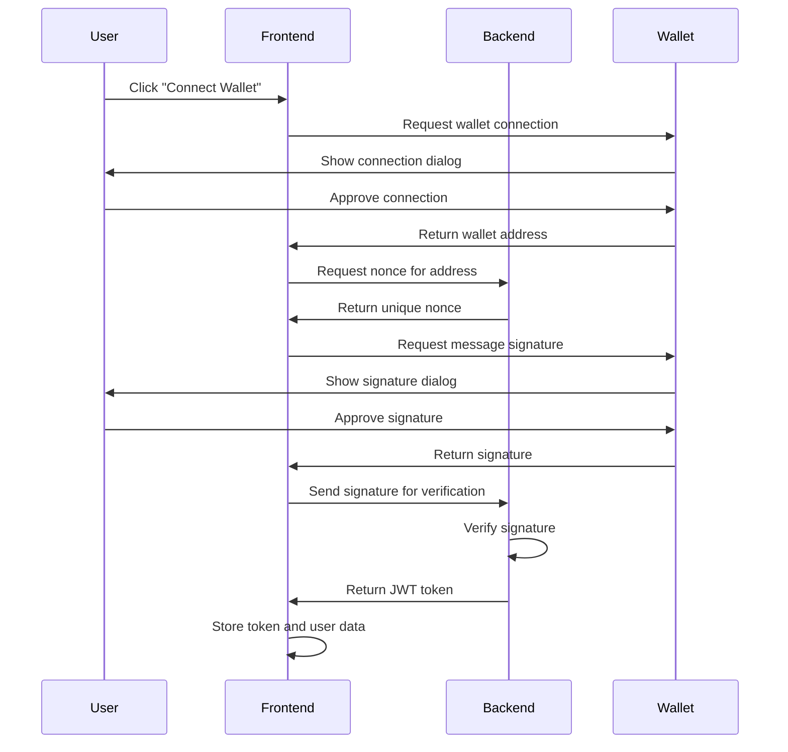

# Web3 Authentication Overview

Base Library implements a sophisticated Web3 authentication system that provides secure, passwordless access using cryptocurrency wallets. This system eliminates traditional password-based authentication while maintaining the highest security standards.

## What is Web3 Authentication?

Web3 authentication is a modern approach to user authentication that leverages blockchain technology and cryptographic signatures. Instead of traditional usernames and passwords, users authenticate using their cryptocurrency wallets, providing:

- **Enhanced Security** - Cryptographic signatures instead of passwords
- **Decentralized Identity** - Your wallet is your identity
- **No Password Management** - Eliminates password-related security risks
- **Cross-platform Access** - Use the same wallet across all devices
- **Privacy Protection** - Minimal data collection and storage

## How It Works

### Authentication Flow

### Technical Implementation

#### 1. Wallet Connection
- **MetaMask Integration** - Primary wallet support
- **WalletConnect** - Mobile wallet compatibility
- **Multi-wallet Support** - Various wallet providers
- **Network Detection** - Automatic network configuration

#### 2. Cryptographic Signatures
- **Message Signing** - Sign authentication messages
- **Nonce-based Security** - One-time use authentication codes
- **Signature Verification** - Backend verification of signatures
- **Replay Attack Prevention** - Unique nonces prevent signature reuse

#### 3. JWT Token Management
- **Secure Token Generation** - Cryptographically signed tokens
- **Automatic Renewal** - Seamless token refresh
- **Cross-session Persistence** - Maintain authentication across sessions
- **Secure Storage** - Encrypted token storage

## Supported Wallets

### Desktop Wallets
- **MetaMask** - Most popular browser wallet
- **Coinbase Wallet** - User-friendly wallet
- **Rainbow Wallet** - Modern wallet interface
- **Trust Wallet** - Multi-chain wallet

### Mobile Wallets
- **WalletConnect** - Universal mobile wallet protocol
- **MetaMask Mobile** - Mobile version of MetaMask
- **Trust Wallet Mobile** - Mobile wallet app
- **Coinbase Wallet Mobile** - Mobile wallet app

### Hardware Wallets
- **Ledger** - Hardware security
- **Trezor** - Advanced hardware wallet
- **KeepKey** - Secure hardware wallet

## Security Features

### Cryptographic Security
- **ECDSA Signatures** - Elliptic curve digital signatures
- **SHA-256 Hashing** - Secure hash algorithms
- **RSA Encryption** - Public key cryptography
- **HMAC Authentication** - Hash-based message authentication

### Session Management
- **JWT Tokens** - JSON Web Token authentication
- **Token Expiration** - Automatic session timeout
- **Refresh Tokens** - Seamless session renewal
- **Secure Storage** - Encrypted local storage

### Network Security
- **HTTPS Only** - Encrypted communication
- **CORS Protection** - Cross-origin request security
- **Rate Limiting** - Protection against abuse
- **Input Validation** - Comprehensive input sanitization

## User Experience

### Simple Connection Process
1. **Click "Connect Wallet"** - Single click to start
2. **Approve Connection** - Confirm in your wallet
3. **Sign Message** - One-time signature (free)
4. **Automatic Login** - Seamless authentication

### No Gas Fees
- **Message Signing** - Completely free operation
- **No Blockchain Transactions** - No gas fees required
- **Instant Authentication** - Immediate access
- **No Network Costs** - No additional fees

### Cross-Device Access
- **Same Wallet, Any Device** - Use your wallet anywhere
- **Automatic Sync** - Seamless device switching
- **Secure Access** - Same security on all devices
- **No Re-registration** - No need to create new accounts

## Privacy and Data Protection

### Minimal Data Collection
- **Wallet Address Only** - No personal information required
- **No Email Collection** - No email addresses stored
- **No Phone Numbers** - No phone number requirements
- **No Personal Data** - No personal information collection

### Data Storage
- **Encrypted Storage** - All data encrypted at rest
- **Secure Transmission** - HTTPS for all communication
- **No Third-party Sharing** - Data never shared with third parties
- **User Control** - Users control their own data

### Transparency
- **Open Source** - All code publicly available
- **Auditable** - All operations can be verified
- **Transparent Processes** - Clear authentication flow
- **User Verification** - Users can verify all operations

## Benefits for Users

### Enhanced Security
- **No Password Vulnerabilities** - Eliminates password-related risks
- **Cryptographic Protection** - Advanced security measures
- **Hardware Security** - Hardware wallet support
- **Multi-factor Authentication** - Wallet + signature verification

### Improved User Experience
- **One-click Login** - Simple authentication process
- **No Password Management** - No need to remember passwords
- **Cross-platform Access** - Use any device
- **Automatic Login** - Seamless authentication

### Future-proof Technology
- **Web3 Native** - Built for the decentralized web
- **Blockchain Integration** - Full blockchain compatibility
- **NFT Support** - Digital asset ownership
- **Decentralized Identity** - True digital identity

## Technical Architecture

### Frontend Components
- **Wagmi v2** - Web3 React hooks
- **Viem** - Ethereum library
- **TanStack Query** - Data fetching and caching
- **React Context** - State management

### Backend Services
- **FastAPI** - Python web framework
- **PostgreSQL** - Database storage
- **JWT Authentication** - Token-based auth
- **Cryptographic Verification** - Signature validation

### Security Measures
- **Input Validation** - Comprehensive input checking
- **SQL Injection Protection** - Database security
- **XSS Prevention** - Cross-site scripting protection
- **CSRF Protection** - Cross-site request forgery prevention

## Getting Started

Ready to experience secure, passwordless authentication?

1. **[Quick Start Guide](./quick-start)** - Set up authentication
2. **[Implementation Details](./implementation)** - Technical implementation
3. **[Security Features](./security)** - Security measures
4. **[Troubleshooting](./troubleshooting)** - Common issues and solutions

---

**Experience the future of authentication** with Base Library's Web3 integration!
