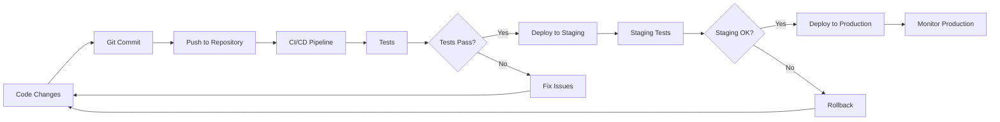

# Getting Started with Base Library

Welcome to Base Library! This guide will help you get up and running quickly with our platform.

## Prerequisites

Before you begin, make sure you have:

- **Node.js** version 20.0 or higher
- **npm** or **yarn** package manager
- **Git** for version control
- A modern web browser with Web3 wallet support (MetaMask, WalletConnect, etc.)

## Quick Setup

### 1. Clone the Repository

```bash
git clone https://github.com/mavaleri1/Base-Library.git
cd base-library
```

### 2. Install Dependencies

```bash
# Install backend dependencies
cd backend
npm install

# Install frontend dependencies
cd ../frontend
npm install
```

### 3. Environment Configuration

Create environment files for both backend and frontend:

```bash
# Backend
cp backend/.env.example backend/.env

# Frontend
cp frontend/.env.example frontend/.env
```

### 4. Start Development Servers

```bash
# Start backend (in one terminal)
cd backend
npm run dev

# Start frontend (in another terminal)
cd frontend
npm run dev
```

## Next Steps

Now that you have Base Library running locally:

1. **Explore Backend**: Learn about our [Backend Architecture](/backend/architecture/overview)
2. **Explore Frontend**: Check out [Frontend Components](/frontend/ui-components/overview)
3. **Web3 Integration**: Set up [Web3 Authentication](/frontend/web3-authentication/quick-start)
4. **Content Generation**: Try our [AI Content Generation](/frontend/content-generation/overview)

## Development Workflow



### Backend Development
- API endpoints and services
- Database management
- AI/ML model integration
- Blockchain interactions

### Frontend Development
- React components
- Web3 wallet integration
- User interface design
- Content generation tools

## Troubleshooting

### Common Issues

**Port already in use:**
```bash
# Kill processes on port 3000
npx kill-port 3000
```

**Node version issues:**
```bash
# Use Node Version Manager
nvm use 20
```

**Dependency conflicts:**
```bash
# Clear cache and reinstall
npm cache clean --force
rm -rf node_modules package-lock.json
npm install
```

## Getting Help

- 📖 **Documentation**: Browse our comprehensive docs
- 🐛 **Issues**: Report bugs on [GitHub](https://github.com/mavaleri1/Base-Library/issues)
- 💬 **Discussions**: Join our community discussions
- 📧 **Support**: Contact our support team

## What's Next?

Ready to dive deeper? Check out our detailed guides:

- [Backend Getting Started](/backend/getting-started) - Complete backend setup
- [Frontend Getting Started](/frontend/getting-started) - Frontend development guide
- [Architecture Overview](/backend/architecture/overview) - System architecture
- [Web3 Authentication](/frontend/web3-authentication/overview) - Blockchain integration

Happy coding! 🚀
