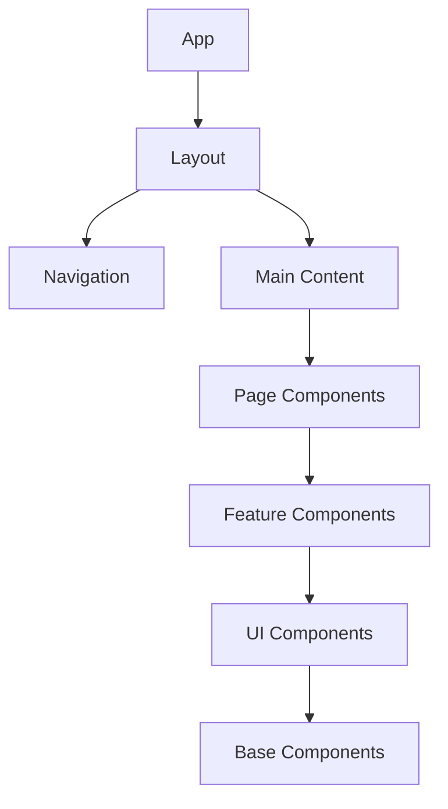

# Welcome to Base Library

Base Library is a comprehensive platform for generating educational content with Web3 authentication and blockchain integration.

## 🚀 What is Base Library?

Base Library is an innovative ecosystem that combines:

- **🤖 AI-Powered Content Generation** - Automatic creation of educational materials
- **🔐 Web3 Authentication** - Secure blockchain-based user management  
- **📚 NFT Educational Materials** - Unique digital content trading
- **🌐 Modern Web Interface** - Intuitive user experience

## 🎯 Key Capabilities

### AI Content Generation
- Mathematical formulas and scientific concepts
- Multi-language support
- Integration with leading AI models

### Web3 Integration
- MetaMask and WalletConnect support
- Decentralized authentication
- NFT marketplace functionality

### Educational Ecosystem
- Content creation tools
- Learning management system
- Community-driven knowledge sharing

## 🏗️ System Architecture

## 📖 Documentation Overview

Our documentation is organized into two main areas:

### Backend Documentation
- **Architecture**: System design and microservices
- **Services**: Core, Article, and Prompt Studio services
- **Security**: Authentication and data protection

### Frontend Documentation  
- **Web3 Authentication**: Blockchain integration
- **UI Components**: Mathematical formulas and interfaces
- **Content Generation**: AI-powered workflows
- **Development**: Setup and deployment guides

## 🏃‍♂️ Quick Start

Ready to get started? Choose your path:

- **[Getting Started Guide](/getting-started)** - Complete setup instructions
- **[Backend Documentation](/backend/getting-started)** - Server-side development
- **[Frontend Documentation](/frontend/getting-started)** - Client-side development

## 🤝 Community & Support

- **GitHub**: [base-library/base-library](https://github.com/mavaleri1/Base-Library)
- **Issues**: Report bugs and request features
- **Discussions**: Join our developer community
- **Documentation**: Comprehensive guides and API references

---

**Ready to build the future of education?** Start with our [Getting Started Guide](/getting-started) and join our community of developers creating the next generation of educational technology! 🚀
